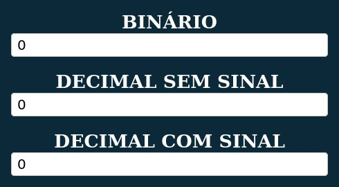

# Bin2Dec
Conversor de binário para decimal feito em Javascript, HTML5 e CSS3

<b>O conversor rodando pode ser acessado
<a href='https://lucianobwille.github.io/Bin2Dec/'>aqui</a>.</b>

<h2>Funcionalidades</h2>

* O usuário pode digitar binários com até 53 digitos;
* O usuário pode digitar números decimais de -9007199254740991 (menor inteiro seguro) a 9007199254740991 (maior inteiro seguro), devido a limitação do javascript;
* <i>O programa realiza a conversão tando de decimais positivos como negativos.</i>
* Quando o usuário insere um valor em algum dos campos os demais são atualizados automaticamente;
* Quando o usuário digitar um valor inválido um alerta é exibido, sumindo quando for feita outra atualização;
 
 
 
A página do conversor é atualmente apresentada desta forma:

